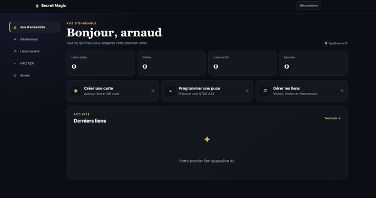
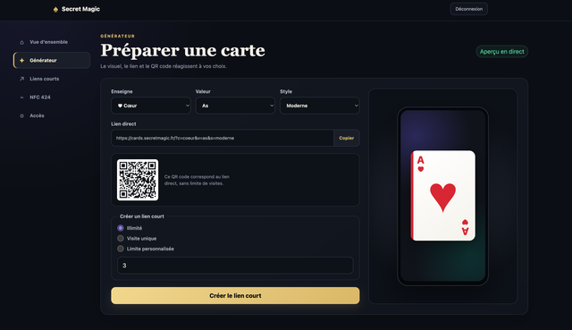
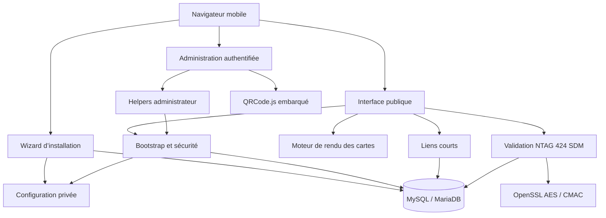

# Secret Magic Cards

Application web mobile permettant de révéler une carte parmi les 52 cartes avec une animation, de créer des liens courts à visites limitées et de programmer des puces **NXP NTAG 424 DNA** en Secure Dynamic Messaging (SDM).



## Fonctionnalités

- Rendu mobile de 52 cartes avec arrivée par le bas, dos visible, puis retournement naturel.
- Paramètres directs abrégés : `c` (enseigne), `v` (valeur) et `s` (style).
- Styles moderne, classique, minimal, figures traditionnelles et ancien Pallas.
- Générateur en direct avec aperçu téléphonique, URL et QR code.
- Liens courts de quatre caractères, illimités, à visite unique ou à limite personnalisée.
- Page de disparition magique lorsque le lien est épuisé ou absent.
- Gestionnaire de puces NTAG 424 DNA avec surnoms, statistiques et suppression confirmée.
- URL SDM signée différente à chaque scan physique et protection anti-rejeu par compteur.
- Comptes `admin` et `utilisateur`, sessions sécurisées et limitation des tentatives de connexion.
- Assistant d’installation en quatre étapes.



## Prérequis

- PHP 8.1 ou supérieur ;
- extensions `pdo_mysql`, `openssl`, `mbstring`, `json`, `hash` et `session` ;
- MySQL ou MariaDB avec une base et un utilisateur existants ;
- Apache 2.4 avec `mod_rewrite` recommandé ;
- certificat HTTPS obligatoire pour la production et le NFC ;
- possibilité de placer les fichiers applicatifs et la configuration hors de la racine publique.

## Structure recommandée

```text
/home/votre-compte/
├── cards_app/                         # contenu du dossier app/
├── cards.secretmagic.config.php       # généré par l’installateur
└── public_html/cards.example.com/     # contenu du dossier public/
```

La séparation protège la configuration SQL, les clés NFC et la logique serveur contre un téléchargement direct.

## Graphe des dépendances



Les seules dépendances d’exécution sont PHP, ses extensions natives déclarées dans `composer.json`, MySQL/MariaDB et la copie locale de QRCode.js. Aucun framework ni service JavaScript tiers n’est chargé par les visiteurs.

## Installation

1. Copiez le contenu de `app/` dans un dossier privé, par exemple `/home/votre-compte/cards_app`.
2. Copiez le contenu de `public/` dans la racine web du sous-domaine.
3. Vérifiez que PHP peut écrire dans la racine publique pendant l’installation et dans le dossier privé parent.
4. Ouvrez `https://votre-domaine.example/install/`.
5. Corrigez les éventuels modules PHP manquants affichés à l’étape 1.
6. Entrez les paramètres MySQL ; l’assistant teste la connexion sans modifier les données.
7. Confirmez les chemins privés, l’URL HTTPS et créez le premier administrateur.
8. Une fois terminé, connectez-vous à `/admin/`.

L’installateur crée les tables, une clé de chiffrement NFC aléatoire, le fichier de configuration privé, le chargeur local et `app/install.lock`. La présence de ce verrou désactive toute nouvelle installation.

## Paramètres des cartes

Exemple :

```text
https://cards.example.com/?c=coeur&v=as&s=moderne
```

Valeurs acceptées :

- `c` : `coeur`, `carreau`, `trefle`, `pique` ;
- `v` : `2` à `10`, `valet`, `dame`, `roi`, `as` ;
- `s` : `moderne`, `classique`, `minimal`, `tetes`, `ancien`.

## Comptes et rôles

- **Administrateur** : accès complet et gestion des comptes.
- **Utilisateur** : générateur, liens courts et NFC ; modification de ses propres identifiants uniquement.

Le premier compte créé par l’installateur est toujours administrateur. Un administrateur ne peut pas modifier son propre rôle ni supprimer le dernier administrateur.

## Liens courts

Les liens utilisent la forme :

```text
https://cards.example.com/?card=Ac12
```

Chaque lien conserve son compteur, sa limite et son état. Il peut être désactivé, réarmé ou supprimé après confirmation.

## NTAG 424 DNA et SDM


Le parcours recommandé utilise **NFC Developer App** sur Android. La version d’essai de l’application demande un CAPTCHA.

1. Ajoutez une puce dans `/admin/nfc.php` et donnez-lui un surnom.
2. Choisissez la carte à révéler.
3. Copiez dans l’application l’URL fournie et l’`Authentication master key`.
4. Conservez le mode AES, désactivez LRP et laissez `Custom data` vide.
5. Programmez la puce sans la verrouiller définitivement pendant les essais.

À chaque scan, la puce produit `picc_data` et `cmac`. Le serveur déchiffre l’identité et le compteur, valide l’AES-CMAC, puis enregistre le couple puce/compteur. La même URL dynamique est refusée une seconde fois, tandis que le scan physique suivant reste valide.


> La compatibilité cryptographique actuelle suit le mode AES et la dérivation utilisée par NFC Developer App. Ne programmez pas une puce avec une autre application sans vérifier la correspondance des clés.

## Sécurité

- mots de passe hachés avec `password_hash()` ;
- cookies `HttpOnly`, `Secure` et `SameSite=Strict` ;
- jetons CSRF sur toutes les mutations administratives ;
- requêtes SQL préparées ;
- limitation temporaire après échecs de connexion ;
- clés maîtres NFC chiffrées en AES-256-GCM dans la base ;
- validation AES-CMAC des scans SDM ;
- verrou anti-rejeu unique par profil, UID et compteur ;
- en-têtes CSP, HSTS, anti-framing et anti-indexation ;
- configuration et code sensible placés hors de la racine publique.

## Mise à jour

Sauvegardez la base et les fichiers privés avant toute mise à jour. Remplacez ensuite les fichiers `app/` et `public/` en conservant :

- `cards.secretmagic.config.php` ;
- `public/cards_loader.php` ;
- `app/install.lock` ;
- les éventuels médias personnalisés.

Les évolutions de schéma sont appliquées automatiquement au premier chargement.

## Licence et contributions

Ce projet est distribué sous [licence propriétaire](LICENSE). Le code est visible pour évaluation et collaboration autorisée, mais aucune permission automatique de copie, modification, déploiement, redistribution ou exploitation commerciale n’est accordée. Contactez le propriétaire du dépôt pour obtenir une autorisation écrite.

Les rapports de bogues doivent exclure mots de passe, clés AES, paramètres SQL et URL SDM complètes.

Voir [CHANGELOG.md](CHANGELOG.md) pour l’historique de la version.
